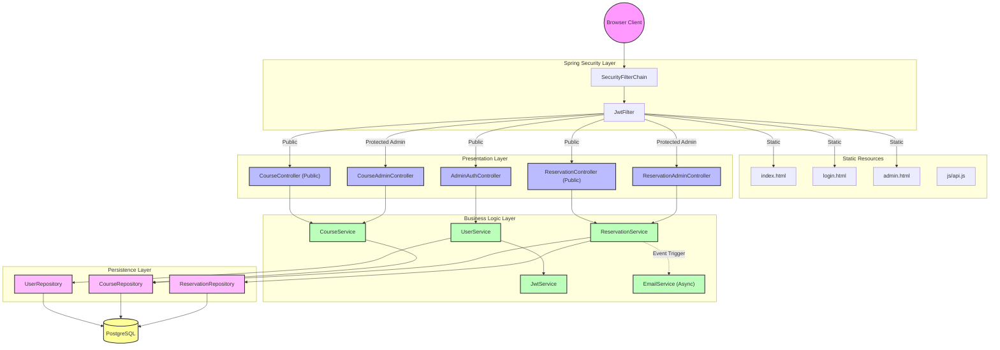
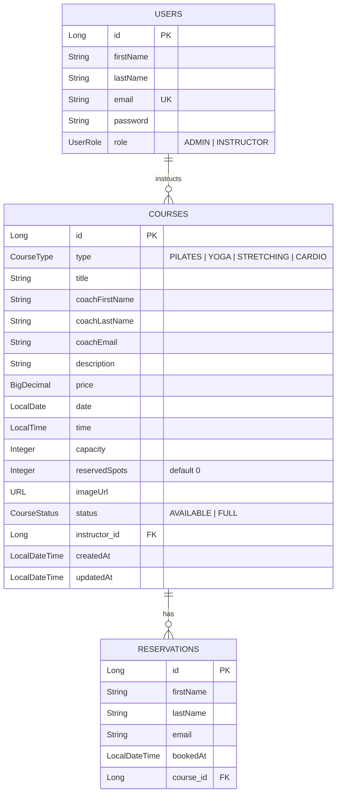
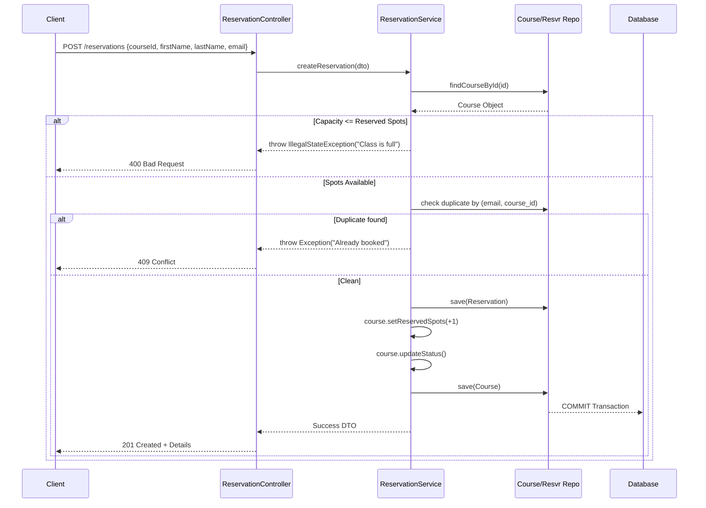

# Comprehensive Backend Architecture Manual

*Souplesse Pilates Studio Backend Service*

This document serves as the exhaustive reference for the Spring Boot backend architecture. It dictates how data is structured, illustrates the relationships, and explicitly outlines the critical impact points — what happens when you edit one piece of the backend, and what other pieces are strictly tied to it.

---

## 1. Core Technological Foundation

The backend strictly adheres to the `souplesse_pilates.studio.souplesse_pilates` package structure and relies on the following stack:

| Technology | Version | Role |
| :--- | :--- | :--- |
| Java | 21 | Core runtime language |
| Spring Boot | 4.0.5 | DI, routing, security, embedded Tomcat |
| Spring Data JPA (Hibernate) | Latest via Boot | ORM layer |
| PostgreSQL | 15 (Docker) | Production database |
| JJWT | 0.12.6 | Stateless JWT creation, signing (HMAC SHA-256), and parsing |
| MapStruct | Latest | Automated entity ↔ DTO bean mapping |
| Lombok | Latest | Boilerplate reduction (`@Getter`, `@Builder`, etc.) |

---

## 2. Monolithic Architecture

The application is a **self-contained monolith**. The frontend (HTML/CSS/JS) is served directly from `src/main/resources/static/` by Spring Boot's embedded Tomcat. There is **no separate frontend server**.

---

## 3. API Route Map

### Public Routes (No JWT Required)

| Method | Endpoint | Controller | Description |
| :--- | :--- | :--- | :--- |
| `GET` | `/courses` | `CourseController` | List all available (non-full) courses |
| `POST` | `/reservations` | `ReservationController` | Book a spot in a course |
| `POST` | `/auth/login` | `AdminAuthController` | Authenticate admin, returns JWT token |

### Protected Admin Routes (JWT + `ROLE_ADMIN` Required)

| Method | Endpoint | Controller | Description |
| :--- | :--- | :--- | :--- |
| `GET` | `/admin/courses` | `CourseAdminController` | List ALL courses (including full) |
| `POST` | `/admin/courses` | `CourseAdminController` | Create a new course |
| `PUT` | `/admin/courses/{id}` | `CourseAdminController` | Update an existing course |
| `DELETE` | `/admin/courses/{id}` | `CourseAdminController` | Delete a course |
| `GET` | `/admin/reservations` | `ReservationAdminController` | List all reservations |
| `GET` | `/admin/reservations/course/{courseId}` | `ReservationAdminController` | List reservations for a specific course |
| `PUT` | `/admin/reservations/{id}` | `ReservationAdminController` | Update a reservation |
| `DELETE` | `/admin/reservations/{id}` | `ReservationAdminController` | Delete a reservation |

---

## 4. Data Dictionary & Entity Relations

### Key Business Rules
- **Unique Constraint**: A `(email, course_id)` unique constraint on `reservations` prevents duplicate bookings at the database level.
- **Capacity Auto-Status**: `Course.updateStatus()` automatically sets `status` to `FULL` when `reservedSpots >= capacity`, and back to `AVAILABLE` otherwise.
- **Timestamps**: `createdAt` is set via `@PrePersist`, `updatedAt` via `@PreUpdate`.

---

## 5. The Booking Lifecycle Engine

---

## 6. Security Configuration

The `SecurityConfig.java` defines all access rules via a `SecurityFilterChain`:

- **Static files** (`/`, `/index.html`, `/login.html`, `/admin.html`, `/css/**`, `/js/**`, `/img/**`) are fully public.
- **Auth endpoint** (`/auth/**`) is public.
- **Public API** (`GET /courses`, `POST /reservations`) is public.
- **Admin API** (`/admin/**`) requires `ROLE_ADMIN` via `@PreAuthorize`.
- **Session policy**: Stateless (`SessionCreationPolicy.STATELESS`).
- **JWT Filter**: Runs before `UsernamePasswordAuthenticationFilter`, extracts and validates tokens from `Authorization: Bearer <token>` headers. Invalid tokens on public routes are gracefully ignored.

---

## 7. Database Seeding Profiles

| Profile | Class | Purpose |
| :--- | :--- | :--- |
| `seed-initial` | `InitialSeeder` | Creates admin user only (if not exists) |
| `seed-running` | `RunningSeeder` | Clears existing courses + creates admin + seeds realistic class data with images |
| `seed-testing` | `TestingSeeder` | Floods database with test data for QA |

All seeders implement `SeedService` interface which provides `createAdminIfNotExists()`.

> **⚠️ DANGER**: Never run `seed-testing` on production. It will fill the live database with fake data.

---

## 8. Critical Editing Rules

### Changing an Entity Field
If you edit an Entity (e.g., adding `phoneNumber` to `Reservation`), you **MUST** update:
1. `Reservation.java` (Entity)
2. `CreateReservationRequestDto.java` (Input DTO)
3. `ReservationResponseDto.java` (Output DTO)
4. `ReservationMapper.java` (MapStruct will fail to compile if fields mismatch)
5. Frontend `booking.js` / `main.js` payload in the `fetch()` call

### Changing Security Rules
Modifying `authorizeHttpRequests` in `SecurityConfig.java` can expose admin routes to the public. Always verify the rule ordering and explicit locks on `/admin/**`.

### MapStruct Mappers
If you rename a field (e.g., `price` → `cost`) in an Entity but not in the DTO, Maven will fail at compile time. Always ensure field names match, or explicitly annotate with `@Mapping(source = "cost", target = "price")`.
