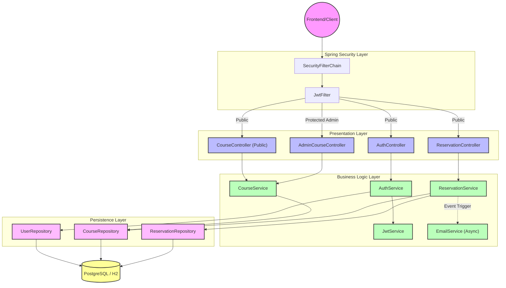
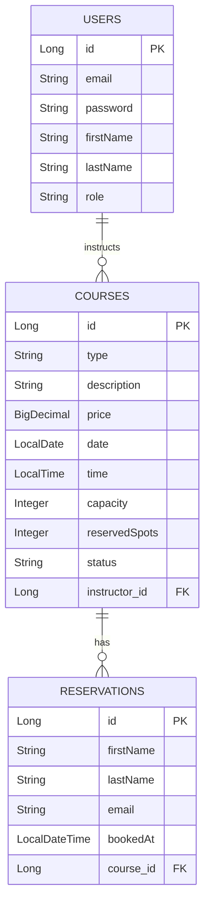
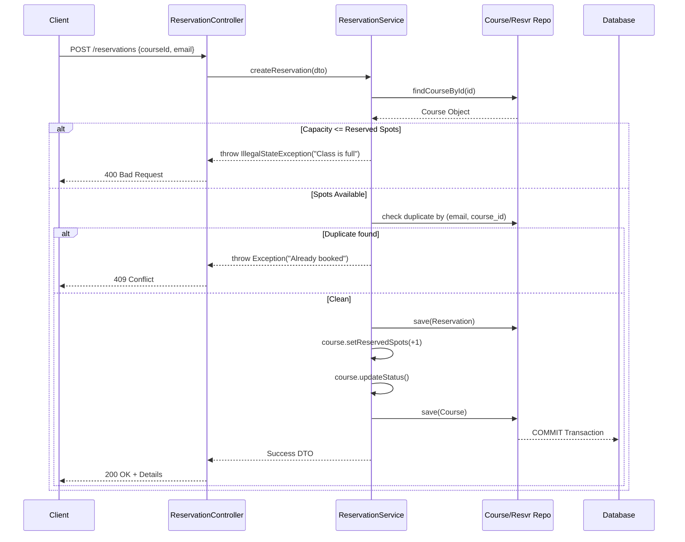

# Comprehensive Backend Architecture Manual

*Souplesse Pilates Studio Backend Service*

This document serves as the exhaustive reference for the Spring Boot backend architecture. It dictates how data is structured, heavily illustrating the relationships, and explicitly outlines the critical impact points—what happens when you edit one piece of the backend, and what other pieces are strictly tied to it.

---

## 1. Core Technological Foundation

The backend strictly adhering to the `souplesse_pilates` package structure relies on the following hardened stack:
*   **Java 21**: Leveraging modern capabilities like records and improved switch statements where applicable.
*   **Spring Boot 4.0.5**: The underlying container managing dependency injection, routing, security, and tomcat hosting.
*   **Spring Data JPA (Hibernate)**: The ORM layer abstracting raw SQL queries into repository interfaces.
*   **H2 & PostgreSQL**: Dual database configuration via profiles. `dev` uses H2 in-memory. Standard execution utilizes the PostgreSQL docker container mapped safely to port `5433` to prevent host collisions.
*   **JJWT (0.12.6)**: Dedicated library managing stateless JSON Web Token creation, signing (HMAC SHA-256), and authorization parsing.
*   **MapStruct**: Interface-based automated bean mappers translating internal `Entities` to external `DTOs`.

---

## 2. System Architecture Diagram

---

## 3. Data Dictionary & Entity Relation

The core schema revolves around three fundamental tables. It is crucial to understand these relations because deleting a "User" who is an instructor could orphan a "Course", which in turn orphans a "Reservation".

### Critical Editing Rules for Entities
> **⚠️ DANGER: Cascading Impacts**
> If you edit an Entity (e.g., adding a `phoneNumber` to `Reservation`), you MUST update the following chain of files to prevent the system from crashing or ignoring the data:
> 1. `Reservation.java` (The Entity)
> 2. `ReservationRequestDTO.java` (The payload the controller expects)
> 3. `ReservationResponseDTO.java` (The payload returned)
> 4. `ReservationMapper.java` (MapStruct will fail to compile if fields are mismatched)
> 5. The Frontend `booking.js` payload sent in the `fetch()` call.

---

## 4. The Booking Lifecycle Engine

The most critical and fragile piece of backend logic is the Reservation Service. It explicitly handles race-conditions.

---

## 5. Maintenance & Safety Guide

When operating in this codebase, adhere to these strictly tied relationships:

### A. Security Configuration
*   **File**: `SecurityConfig.java`
*   **Risk Level**: **EXTREME**
*   **Impact**: Modifying `authorizeHttpRequests` mappings carelessly can expose admin routes (`/admin/**`) to public users. 
*   **Rule**: Always use `.requestMatchers(HttpMethod.GET, "/public/**").permitAll()` and explicitly lock down `.anyRequest().authenticated()`.

### B. MapStruct Mappers
*   **File**: Interfaces annotated with `@Mapper` in `mapper` package.
*   **Risk Level**: **HIGH**
*   **Impact**: If you rename an entity field from `price` to `cost`, but the DTO stays as `price`, Maven will fail to compile. MapStruct generates implementation classes during the `mvn compile` phase.
*   **Rule**: Always verify field names cleanly align between Entity and DTO, or explicitly document `@Mapping(source = "cost", target = "price")`.

### C. Database Seeding Profiles
*   **Location**: `config/seed/`
*   **Status**: Currently utilizing three distinct profiles (`seed-initial`, `seed-running`, `seed-testing`).
*   **Impact**: Never run `seed-testing` in the production environment. It will flood the live database with fake instructors and max-capacity courses. Ensure `application-prod.yaml` explicitly disables these profiles or lacks the `CommandLineRunner` beans entirely.
