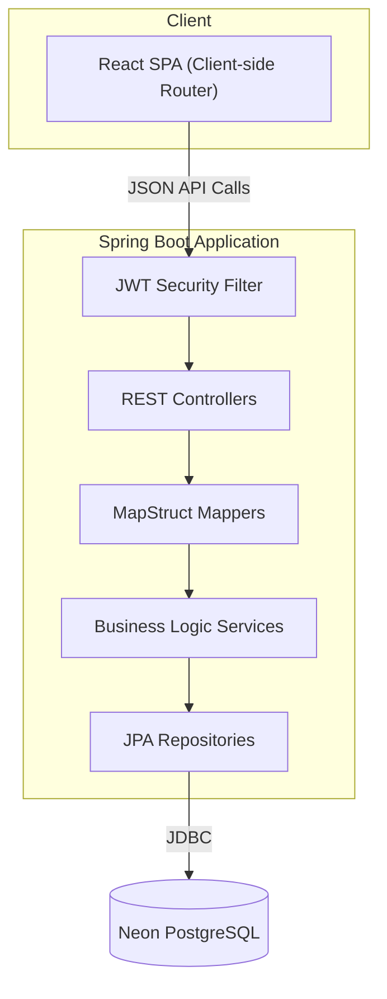

# Comprehensive Backend Architecture Manual

*Souplesse Pilates Studio Backend Service*

This document serves as the exhaustive reference for the Spring Boot backend architecture. It outlines how the server provides a robust API for the modernized SPA, manages security, and handles data persistence.

---

## 1. Core Technological Foundation

The backend uses a standard Spring Boot stack optimized for stability and developer productivity.

| Technology | Role |
| :--- | :--- |
| **Java 21** | Core runtime using modern language features. |
| **Spring Boot 4.0.5** | Core framework for REST controllers, Security, and DI. |
| **Spring Data JPA** | Hibernate ORM for PostgreSQL interaction. |
| **Neon PostgreSQL** | Serverless production database (managed). |
| **JJWT (0.12.6)** | Stateless JWT authentication system. |
| **MapStruct** | Automated Entity ↔ DTO mapping. |

---

## 2. Integrated Monolith Architecture

The backend serves both as the **API Provider** and the **Static Assets Host**.

- **Routing Logic**: All public URLs (`/`, `/#/admin`, etc.) are served via a single `index.html`. The backend is configured to let the React `HashRouter` manage deep links.
- **REST Logic**: Backend controllers exclusively exchange JSON with the frontend, except for file-based operations (XLSX exports).

---

## 3. Advanced Seeding Strategy

The application uses sophisticated seeders enabled via Spring Profiles to manage sandbox environments.

| Profile | Strategy | Result |
| :--- | :--- | :--- |
| `seed-initial` | Minimalist | Creates only the default admin (`admin@souplesse.dz`). |
| `seed-running` | Interactive | Populates courses, instructors, and dummy reservations for demos. |
| `seed-testing` | Unit/QA | Predictable data specifically shaped for automated browser tests. |

---

## 4. API & Resource Mapping

### Reservation Engine Logic
1. **Course Lookup**: Verifies the course exists and is not `CourseStatus.FULL`.
2. **Duplicate Guard**: Checks for existing `(email, course_id)` pairs to prevent double-booking.
3. **Transactionality**: Reservation creation and Course capacity decrement are performed in a single `@Transactional` block.
4. **Notifications**: Asynchronous `EmailService` sends confirmation/notification emails upon successful commitment.

---

## 5. Security & Lifecycle

- **Statelessness**: No server-side sessions. All state is contained in the JWT.
- **Role Hierarchy**: 
    - `ROLE_ADMIN`: Full CRUD on courses, reservations, and instructors.
    - `ROLE_INSTRUCTOR`: Restricted read-only access (planned).
- **Environment Safety**: Production profile disables destructive seeders and enforces strict CORS policies.

---

## 6. Critical Operational Rules

1. **Entity Changes**: Any change to `@Entity` classes must be reflected in the corresponding `Dto` and `Mapper` to ensure the MapStruct generation does not fail.
2. **Migration Path**: Database schema is managed via Hibernate's `ddl-auto=update` for rapid iteration, with Neon snapshots used for production backups.
