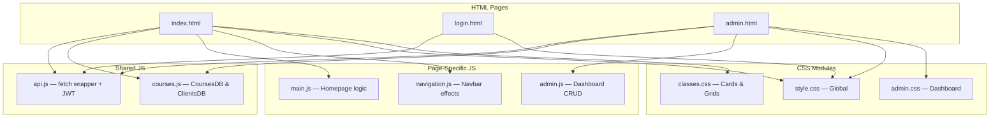

# Comprehensive Frontend Architecture Manual

*Souplesse Pilates Studio User Interface*

This document is the source of truth for the Souplesse Pilates frontend. It explains the Vanilla architecture, the JavaScript API bridge, the DOM manipulation strategy, and explicitly maps the critical coupling points.

---

## 1. Architectural Philosophy

The frontend uses **Vanilla HTML5, CSS3, and ES6 JavaScript** — no frameworks, no bundlers, no build step. The UI is served directly by Spring Boot from `src/main/resources/static/`. All API calls use relative paths (e.g., `fetch('/courses')`), meaning **zero CORS configuration is needed** for production.

---

## 2. Directory Structure & File Map

```
src/main/resources/static/
├── index.html          # Public landing page + booking flow
├── login.html          # Admin authentication page
├── admin.html          # Secure admin dashboard
├── pilimg.jpeg         # Studio background image
├── css/
│   ├── style.css       # Global variables, layout, typography
│   ├── classes.css     # Course cards, grids, booking wizard
│   └── admin.css       # Dashboard layout, forms, tables
└── js/
    ├── api.js          # Central API client (fetch wrapper + JWT)
    ├── courses.js      # CoursesDB & ClientsDB async API bridges
    ├── main.js         # Homepage logic: hero, booking wizard, testimonials, gallery
    ├── booking.js      # (Legacy) booking-specific logic
    ├── admin.js        # Dashboard CRUD: courses, reservations, settings
    ├── navigation.js   # Navbar scroll effects, mobile menu
    └── email.js        # Contact form email handling
```



---

## 3. The API Client (`js/api.js`)

The central module handling **all** communication between the frontend and the Spring Boot backend.

### Key Features
- **Relative Paths**: `API_BASE = ''` — all requests go to the same origin (e.g., `/courses`, `/admin/courses`).
- **Automatic JWT Injection**: Reads `souplesse_jwt` from `localStorage` and adds `Authorization: Bearer <token>` to every request except `/auth/login`.
- **Global 401 Handling**: When a `401 Unauthorized` is received, the client automatically clears the stored token and redirects to `/login.html`.
- **204 No Content**: Properly handles delete responses with no body.

### Methods
| Method | Signature | Description |
| :--- | :--- | :--- |
| `get` | `api.get(endpoint)` | GET request |
| `post` | `api.post(endpoint, body)` | POST with JSON body |
| `put` | `api.put(endpoint, body)` | PUT with JSON body |
| `delete` | `api.delete(endpoint)` | DELETE request |

---

## 4. Data Modules (`js/courses.js`)

### `CoursesDB` — Course API Bridge

| Method | API Call | Description |
| :--- | :--- | :--- |
| `getAll()` | `GET /courses` (public) or `GET /admin/courses` (admin) | Auto-detects page context |
| `add(data)` | `POST /admin/courses` | Creates a new course |
| `update(id, data)` | `PUT /admin/courses/{id}` | Updates an existing course |
| `remove(id)` | `DELETE /admin/courses/{id}` | Deletes a course |
| `spotsLeft(course)` | — (computed) | Returns `capacity - reservedSpots` |

**Field Mapping**: The response from the API is transformed to add computed properties:
- `coach` = `coachFirstName + coachLastName`
- `dateTime` = `date + 'T' + time`
- `image` = `imageUrl`

### `ClientsDB` — Reservation API Bridge

| Method | API Call | Description |
| :--- | :--- | :--- |
| `getAll()` | `GET /admin/reservations` | Lists all reservations |
| `add(client)` | `POST /reservations` | Creates a new reservation |
| `remove(id)` | `DELETE /admin/reservations/{id}` | Deletes a reservation |

---

## 5. Page Logic

### Homepage (`index.html` ↔ `main.js`)
1. On `DOMContentLoaded`, `CoursesDB.getAll()` is called asynchronously.
2. Course cards are rendered into `#coursesGrid` via template literals.
3. The **3-step booking wizard** handles: Date/class selection → Details form (Nom, Prénom, Email) → Confirmation via `POST /reservations`.
4. Testimonials, gallery, and FAQ sections are rendered from local data arrays.

### Admin Dashboard (`admin.html` ↔ `admin.js`)
1. On load, checks `localStorage` for `souplesse_jwt`. Redirects to `/login.html` if missing.
2. Fetches all courses and reservations via `CoursesDB.getAll()` and `ClientsDB.getAll()`.
3. Provides CRUD operations: create/edit/delete courses, view/delete reservations.
4. Dashboard summary cards show total courses, total reservations, and capacity metrics.

### Login (`login.html`)
1. Submits credentials to `POST /auth/login`.
2. On success, stores the JWT token in `localStorage` as `souplesse_jwt`.
3. Redirects to `/admin.html`.

---

## 6. Editing Guidelines: The Impact Matrix

> **⚠️ DANGER: Breaking The DOM Bindings**
> The JavaScript is heavily coupled to element `#ID`s and `.class` names. Altering HTML IDs or structural wrappers carelessly will instantly break the application silently.

### Impact 1: Changing Element IDs
- **Example**: Changing `<div id="coursesGrid">` to `<div id="class-list">`.
- **What breaks**: `main.js` calls `document.getElementById('coursesGrid')` → returns `null` → homepage stays blank.
- **Fix**: Globally search and replace the ID string in the corresponding `.js` file.

### Impact 2: Changing CSS Grid/Flex Structures
- **Example**: Altering `.class-card` from `display: flex` to `display: block`.
- **What breaks**: Visual alignment. Because `main.js` renders card inner HTML as template strings, the parent CSS must match the nested HTML structure.

### Impact 3: Expanding the API Payload
- **Example**: Backend adds `durationInMinutes` to the Course JSON.
- **What breaks**: Nothing actively breaks. But to display it, you must edit the template literal in `main.js`:
  ```javascript
  `<span class="duration">${course.durationInMinutes} mins</span>`
  ```

---

## 7. Adding New Features (Checklist)

To add a new page (e.g., `instructors.html`):
1. **Create** `instructors.html` using the global `<nav>` from `index.html`.
2. **Link** `css/style.css` for base resets and `js/api.js` for API access.
3. **Create** `js/instructors.js`.
4. **Backend Call**: Write `api.get('/instructors')` inside your `DOMContentLoaded` handler.
5. **Render**: Target a predefined `<div id="instructor-roster">` and inject parsed HTML strings.
6. **Security**: Ensure the new endpoint is added to `SecurityConfig.java` with the correct access level (`permitAll()` or `.hasRole("ADMIN")`).
