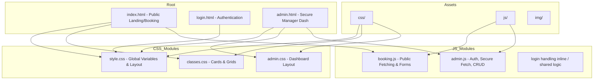
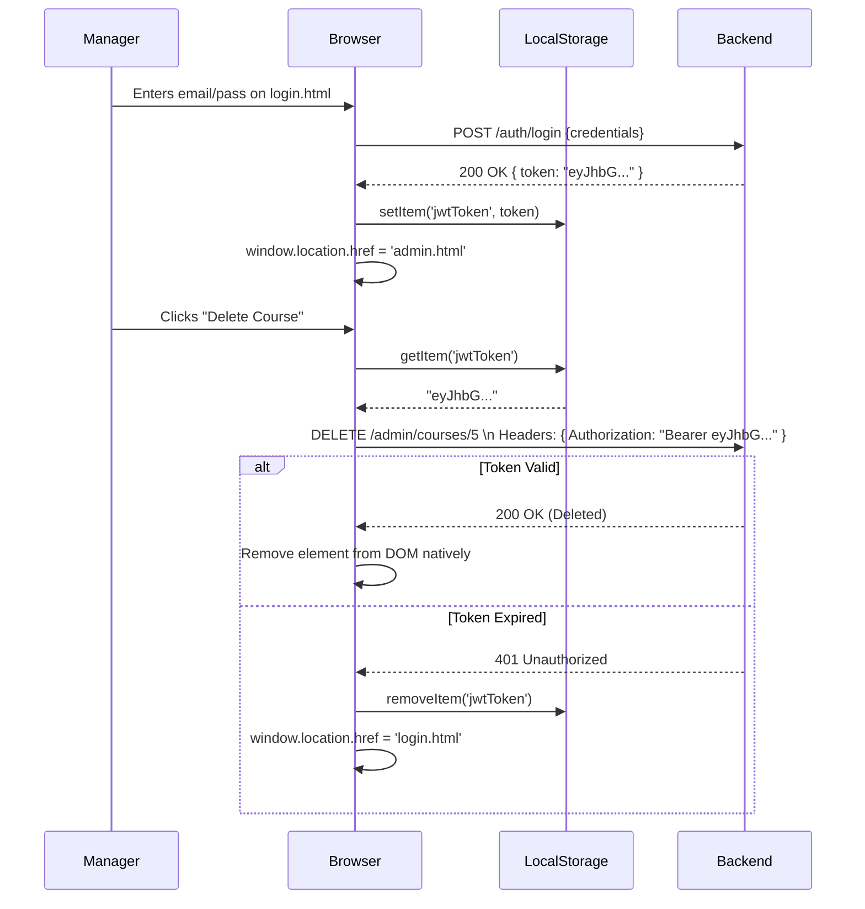

> [!WARNING]
> **ARCHIVED / HISTORICAL DOCUMENT**
> This document was part of the original design specifications. The application has since been refactored into an integrated, monolithic Spring Boot architecture where the frontend loads natively from `src/main/resources/static/`. Please refer to the root `README.md` for current, accurate operational instructions.

# Comprehensive Frontend Architecture Manual

*Souplesse Pilates Studio User Interface*

This document serves as the absolute source of truth for the Souplesse Pilates frontend. It explains the stateless Vanilla architecture, the JavaScript API bridge, the DOM manipulation strategy, and explicitly maps the danger zones when altering UI elements.

---

## 1. Architectural Philosophy

We have elected to use **Vanilla HTML5, CSS3, and ES6 JavaScript**. 
Why? Because the scope of the application (Browsing courses, booking an appointment, rendering a basic dashboard) does not necessitate forcing a Virtual DOM payload (React) onto the end user. This guarantees perfect SEO, blazing fast parsing times, and infinite longevity without "npm audit" framework death.

---

## 2. Directory Structure & Relationships



---

## 3. The Backend Bridge (Fetch Interface)

The exact flow of how the frontend communicates with the backend is entirely contained within the native `fetch()` API.

### Public Lifecycle (`index.html` <-> `booking.js`)
When a user visits the homepage, immediately the following sequence triggers:
1. `document.addEventListener('DOMContentLoaded')` fires.
2. `fetch('http://localhost:8080/courses')` is executed via a `GET` request.
3. The JSON array is parsed.
4. An HTML template string is generated for each course object.
5. The DOM element `document.getElementById('courses-grid').innerHTML` is updated.

### Private Lifecycle (`admin.html` <-> `admin.js`)
Security is managed strictly via `localStorage` on the client side.



---

## 4. Editing Guidelines: The Impact Matrix

Because we rely on Vanilla JS, our JavaScript is heavily coupled to element `#ID`s and `.class` names in the structural HTML. 

> **⚠️ DANGER: Breaking The DOM bindings**
> Altering the HTML classes or structural wrappers carelessly will instantly break the application silently (JavaScript will throw null-pointer exceptions in the console).

### Impact 1: Changing Element IDs
*   **What you do**: Changing `<div id="courses-grid">` to `<div id="upcoming-classes">` in `index.html`.
*   **What breaks**: `booking.js` calls `document.getElementById('courses-grid')`. It will return `null`. The homepage will stay blank forever. 
*   **The Fix**: You must globally search and replace the ID string in the associated `.js` file immediately.

### Impact 2: Changing Class Structure (CSS Grid/Flexbox)
*   **What you do**: Altering `.class-card` from `display: flex` to `display: block` in `classes.css`.
*   **What breaks**: Visual alignment. But technically, because `booking.js` renders the inner HTML of the card dynamically as a massive template string, if you alter the parent CSS, you MUST update the template string inside `booking.js` to match the new nested HTML structure you intend to style.

### Impact 3: Expanding the API Payload
*   **What you do**: The backend adds a `durationInMinutes` field to the Course JSON.
*   **What breaks**: Nothing actively breaks. Vanilla JS loosely parses JSON. However, to display this to the user, you must manually edit the template literal mapping inside `booking.js`:
    ```javascript
    // Add this to the template string
    `<span class="duration">${course.durationInMinutes} mins</span>`
    ```

---

## 5. Adding New Features (Checklist)

If you need to add a brand new page, for example, `instructors.html` (public view):
1.  **Create** `instructors.html` utilizing the global `<nav>` from `index.html`.
2.  **Ensure** it links `css/style.css` for base resets.
3.  **Create** `js/instructors.js`.
4.  **Backend Call**: Write a `fetch('http://localhost:8080/api/public/instructors')` block inside your DOMContentLoaded handler.
5.  **Render**: Target an empty predefined `<div id="instructor-roster">` and inject the parsed HTML strings.
