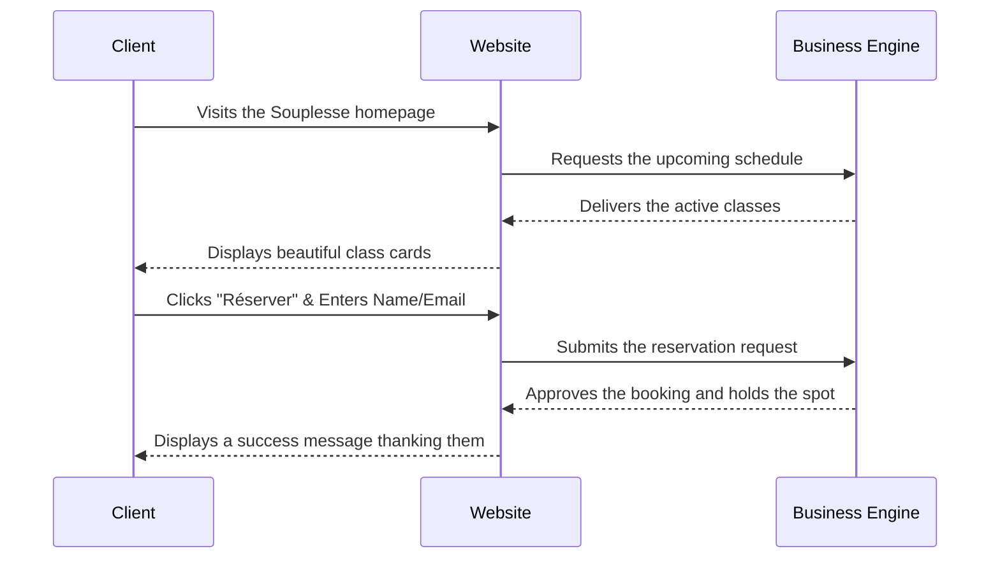
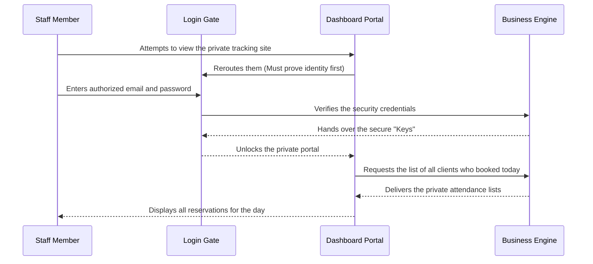
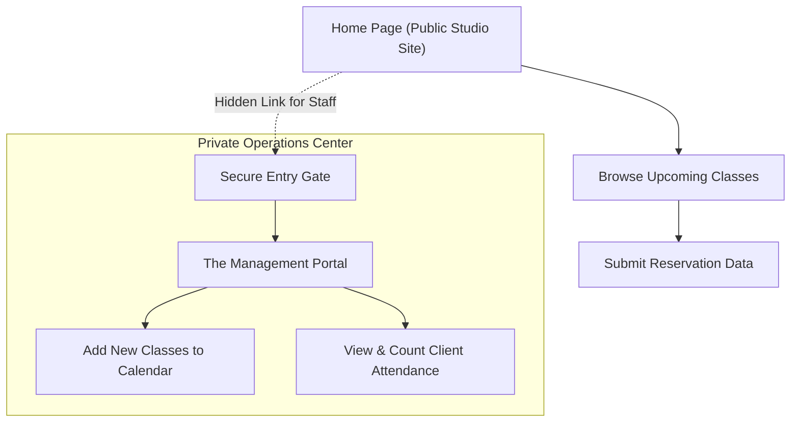

# Souplesse Pilates — Product Summary

This document serves as a high-level overview of the **Souplesse Pilates** platform. It is written to clearly explain what the software does, who it is built for, and the core value it provides, entirely free of technical jargon.

---

## 1. The Core Product
Souplesse Pilates is a digital booking and studio management platform. It operates as a modern, unified hub where clients can seamlessly discover and reserve workout classes, while empowering studio owners with the administrative tools needed to effortlessly run their business operations behind the scenes.

## 2. Key Features
*   **Smart Class Scheduling:** The platform automatically manages the passage of time. Past classes vanish from the public view, while upcoming classes are beautifully organized so clients always see exactly what is happening next.
*   **Automatic Overbooking Prevention:** The moment a class reaches its maximum physical capacity, the system instantly stops accepting reservations, protecting the studio from overcrowded sessions without requiring manual oversight.
*   **Centralized Studio Management:** A secure, digital command center where studio owners can instantly publish new classes to the calendar and track exactly who is attending.
*   **Beautiful Desktop & Mobile Experience:** A calm, premium interface designed exclusively around the "Move Beautifully" aesthetic, ensuring clients feel a sense of luxury before they even step foot in the studio.

## 3. The Three Core Pages
The platform is built elegantly across three main destinations:
1.  **The Public Studio Page:** This is the public face of the business. Clients browse here to see the schedule, read class descriptions, and book their spots.
2.  **The Secure Entry Gate:** A hidden login page accessible only to authorized staff. Staff must use their email and secure passwords here to prove their identity.
3.  **The Management Portal:** A private tracking dashboard. Once logged in, this is where instructors and owners oversee class capacities, view the names of clients attending, and create new scheduling events.

## 4. Who Is This Built For?

| Target Audience | Their Goal | How They Access It |
| :--- | :--- | :--- |
| **Studio Clients** | To find balance, view upcoming schedules, and reserve their spot in an exercise class. | They simply visit the public website. No account creation required, making booking instantly frictionless. |
| **Studio Staff & Owners** | To run the business, control the calendar, and track attendance. | Requires highly secured, private credentials assigned by the studio owner. |

## 5. What Information Does the System Manage?
The platform safely tracks three core pillars of the business:
*   **Staff Profiles:** The names, emails, and security clearance roles of the instructors running the platform.
*   **Class Schedules:** Prices, dates, times, types of workouts (Yoga, Pilates), and the maximum number of people allowed in a room.
*   **Client Reservations:** The names and emails of the clients who have claimed a spot on the calendar for a specific class.

---

## 6. Client Experience Flow

The following diagram demonstrates exactly how a typical client interacts with the platform from start to finish.

## 7. Staff Management Flow

This flow tracks how an authorized instructor operates within the system.

---

## 8. Site Map

This diagram illustrates the simple layout of the entire product. Notice how the public is completely separated from the private operations center.

