# UI / UX Mastery & Design Philosophy

*Creating the "Move Beautifully" Digital Experience*

This document breaks down the fundamental visual and experiential laws governing the Souplesse Pilates platform. UI (User Interface) governs the aesthetics and structural layout. UX (User Experience) governs the emotional flow, friction reduction, and logical progression of tasks.

---

## 1. The Core Philosophy
The interface was built to evoke the physical environment of a high-end Pilates studio:
*   **Breatheable**: Massive utilization of negative space (whitespace). Things are not crammed together.
*   **Organic**: Soft edges, subtle curved backgrounds, and warm, muted photography avoiding harsh stock imagery.
*   **Calm**: Interface animations are limited to opacity fades and smooth translations. No aggressive bouncing or rapid flashing.

---

## 2. Visual Architecture & Hierarchy

```mermaid
graph TD
    subgraph Layers ["Visual Layering Hierarchy"]
        Z3["Z-Index 3: Modals / Toasts / Dropdowns"] --- Z2["Z-Index 2: Sticky Navigation Header"]
        Z2 --- Z1["Z-Index 1: Content Cards / Buttons"]
        Z1 --- Z0["Z-Index 0: Organic SVG Background Curves"]
    end
    
    subgraph Typography ["Brand Typography"]
        Primary["Headings: Elegant Serif or Thin Sans-serif"] --- Secondary["Body: Highly readable Sans-serif"]
    end
    
    subgraph Colors ["Color Paradigm"]
        C1("Slate Charcoal: #2C3E50 - Primary Text") --- C2("Muted Sand: #F5F1E7 - Secondary Background")
        C2 --- C3("Desaturated Teal: #456972 - Accent Buttons")
        C3 --- C4("Pure White: #FFFFFF - Card Backgrounds")
    end
```

---

## 3. Experiential States

To prevent user confusion, every interactive element must account for four specific states. 

### A. The Loading State (Anticipation)
When a user clicks "Book Now" or the dashboard fetches data:
*   **Visual**: A subtle spinning indicator replaces the button text. The button becomes uninteractable (disabled). Skeleton loaders (gray pulsing boxes) are preferred over full-page blocking spinners if loading class lists.

### B. The Empty State (Graceful Degradation)
If there are no classes scheduled (e.g., the `seed-initial` database profile is active):
*   **UX Law**: A blank screen is a broken screen. 
*   **Implementation**: We render an elegant message: "Aucune classe disponible pour le moment." (No classes available right now). In the admin panel, we accompany this with a primary call to action button: "Add your first class."

### C. The Error State (Calm Correction)
If the backend returns a `409 Conflict` (user already booked) or a `500 Server Error`:
*   **Implementation**: A toast notification slides in smoothly from the bottom right or top. It utilizes soft red colors (not neon) and provides *human-readable feedback*. 
*   **Fatal flaw to avoid**: Never dump unparsed Java stack-traces directly to the DOM.

### D. The Success State (Dopamine Release)
*   **Implementation**: A green checkmark toast, button color shifting from teal to success green. Instantaneous feedback.

---

## 4. Editing the UI: Impact & Risk Map

Changing the UI requires strict coordination with CSS rules and Javascript bindings.

### Risk Area: Responsive Breakpoints
*   **What**: The `@media (max-width: 768px)` blocks inside `style.css` control mobile rendering.
*   **Impact**: Deleting or misconfiguring flexbox directions here will instantly destroy the mobile booking experience. 
*   **Rule**: Always test with Chrome DevTools on iPhone 12/14 sizing after editing *any* flex-container class.

### Risk Area: The Modal Trap (Z-Indexing)
*   **What**: The Booking overlay form.
*   **Impact**: If you adjust the parent container's `z-index` to be higher than the modal overlay, the modal will appear beneath the content, making the site un-bookable.
*   **Rule**: Global overlays must retain `z-index: 1000+` and be appended as close to the closing `</body>` tag as structurally sensible.

### Risk Area: Class Status Modifiers
*   **What**: CSS rules governing the `FULL` status of a class.
*   **Impact**: If `booking.js` identifies a class as full, it applies `.card-disabled` or obscures it. If a designer changes the CSS of `.class-card` avoiding `.card-disabled`, users might attempt to book a full class, causing a backend error cascade.
*   **Rule**: Visual state classes (`.is-loading`, `.is-full`, `.is-hidden`) must heavily override base styles using `!important` or high-specificity selectors to guarantee component state enforcement.
