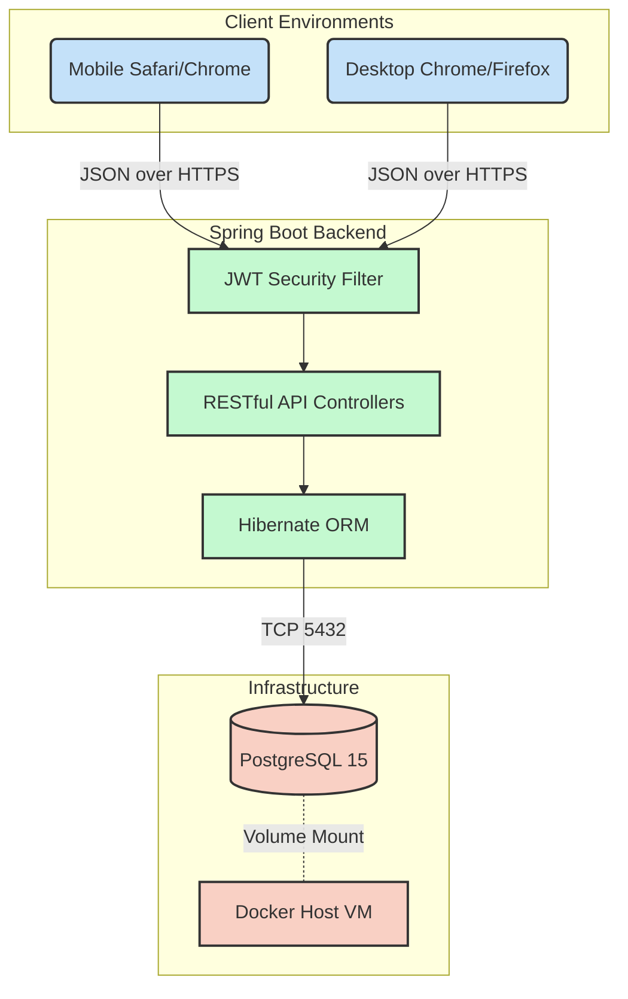

> [!WARNING]
> **ARCHIVED / HISTORICAL DOCUMENT**
> This document was part of the original design specifications. The application has since been refactored into an integrated, monolithic Spring Boot architecture. Please refer to the root `README.md` for current, accurate operational instructions.

# High-Level Architecture & Workflow Protocol

*Author: System Architect / Technical Lead*

This document dictates the absolute laws governing how the Souplesse Pilates platform is developed, scaled, repaired, and deployed. It unifies the Backend, Frontend, and UI/UX layers into a singular, predictable operational workflow.

---

## 1. The Macro Architecture Flow

Before a developer writes a line of code, they must comprehend how the entire system communicates at a macro scale.

---

## 2. Feature Implementation Pipeline

Adding a new feature to this project requires bridging the frontend and backend. We use an **API-First Development Strategy**.

### Scenario: Implementing "Promo Codes"
If leadership decides users should be able to enter promo codes for discounts:

1.  **Database Migration (Backend)**: 
    *   Create a `PromoCode` entity. 
    *   *Impact Warning*: Modifying the DB schema without a migration script (like Flyway/Liquibase) will cause production DB crashes. In our current ORM setup, `hibernate.ddl-auto=update` handles this, but it is risky for destructive changes (like dropping a column).
2.  **The API Contract (Backend)**: 
    *   Expose `POST /api/promo/validate`. 
    *   Define the exact JSON payload the frontend must send: `{ "code": "SUMMER20", "courseId": 5 }`.
    *   Define the return payload: `{ "valid": true, "newPrice": 1500 }`.
3.  **UI/UX Implementation (Frontend)**: 
    *   Open `index.html` and inject the Promo Code input field into the booking modal.
    *   Update `booking.js` to intercept the input, call the new API, apply a loading spinner (UI Law), and update the displayed total.

---

## 3. Third-Party Integration Protocol

We do not tightly couple our system to third-party vendors. If a vendor goes out of business or raises prices, rewriting the app should take hours, not weeks. **We use the Adapter Pattern for everything foreign.**

### Integrating an Email Provider (e.g., SendGrid / Mailchimp)
*   **Wrong Way**: Directly importing the SendGrid Java SDK into the `ReservationService` and halting the reservation if the SMTP server times out.
*   **Right Way**: 
    1. Define a generic interface: `EmailSenderInterface.java`.
    2. Spring Boot emits a generic `ReservationCreatedEvent` asynchronously.
    3. An independent `NotificationWorker` listens to the event and calls the interface. 
    4. If the email fails, the customer still gets their booked class securely placed in the database.

### Integrating Payments (Stripe / Local Banks)
1.  **Rule 1**: The Vanilla JS frontend **never** stores or processes credit card numbers natively. It only ever loads the Payment Gateway's secure iframe/tokenization SDK.
2.  **Rule 2**: The Database never marks a reservation as `PAID` based on a frontend JS API call (because hackers can spoof HTTP payloads). The DB only marks `PAID` via a secure, cryptographically verified Server-to-Server Webhook from Stripe to Spring Boot.

---

## 4. Deployment & Infrastructure Workflow

### The Environments
1.  **Local (Dev)**: 
    *   Uses H2 In-Memory DB via Spring Profile `dev` and Seeding Profiles (`seed-running`).
    *   Frontend served by a local Live Server or directly via Spring Tomcat on `localhost:8080`.
2.  **Production**: 
    *   Uses Docker Compose.
    *   Database: Dockerized `postgres:14-alpine` bound to persistent local volumes. (Note: Specifically locked to v14 to maintain backwards compatibility with `docker-compose v1.29.2` environments).
    *   Port Mapping: Maps to host port `5433` (i.e. `5433:5432`) to elegantly avoid aggressive TCP collisions with natively installed PostgreSQL services.

### The Danger Matrix: Editing Production
| Action | Associated Risk | Mandatory Pre-Check |
| :--- | :--- | :--- |
| Changing JWT Secret Key | High | All currently logged-in Admin tokens will instantly invalidate, forcing a mass re-log. |
| Altering PostgreSQL `docker-compose.yml` volume path | Fatal | Will erase the entire production database mapping, wiping all reservations. |
| Changing `Course` properties | Medium | Must update Entity, DTO, Mappers, and Frontend JS parsers synchronously. |
| Changing `application-prod.yaml` DB Password | High | Will instantly crash the app on startup if the Docker env variables don't match. |

## 5. Summary Protocol for the Team
*   **Frontend devs**: Don't wait for backend completion. Mock the JSON response and build the UI.
*   **Backend devs**: Only expose exactly what the frontend needs via DTOs to save bandwidth. Protect the `ADMIN` routes aggressively.
*   **UX designers**: Test the `seed-initial` empty states, not just the heavily populated `seed-testing` golden-path states.
