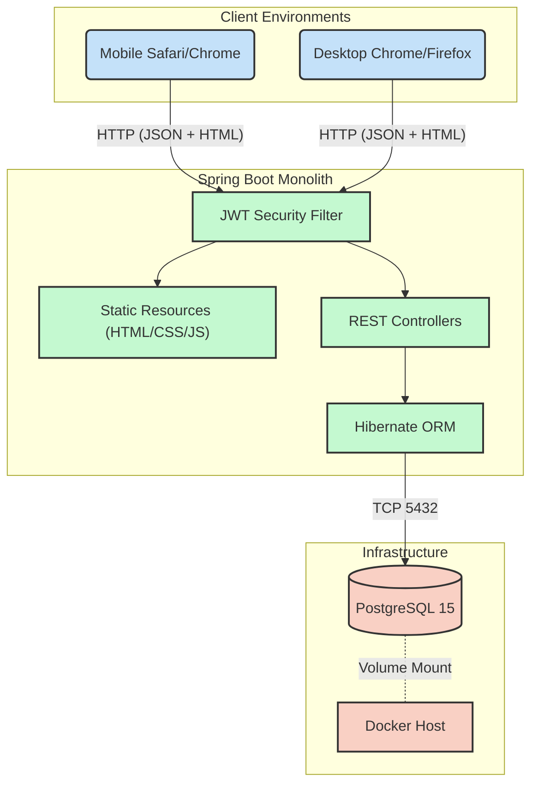

# High-Level Architecture & Workflow Protocol

*Development, Scaling, and Deployment Guide*

This document dictates how the Souplesse Pilates platform is developed, scaled, repaired, and deployed. It unifies the Backend, Frontend, and UI/UX layers into a predictable operational workflow.

---

## 1. The Macro Architecture

The application is a **modernized monolith** featuring a **React-based Single Page Application (SPA)** embedded within a Spring Boot service. The frontend is serves as a collection of modular bundles (`js/bundles/*.jsx`) processed via Babel in the browser, ensuring a clean separation of concerns and high maintainability.



---

## 2. Development Workflow

### Local Development Setup

1. **Start the database** (via Docker):
   ```bash
   docker compose up -d db
   ```

2. **Run the application** with seeded data:
   ```bash
   ./mvnw spring-boot:run -Dspring-boot.run.profiles=seed-running
   ```

3. **Access the app**: Open `http://localhost:8080` in your browser.

### Making Changes

| Change Type | Files to Edit | Rebuild Needed? |
| :--- | :--- | :--- |
| Frontend HTML/CSS/JS | `src/main/resources/static/*` | No (hot reload by refreshing browser) |
| Backend Java | `src/main/java/**` | Yes (restart Spring Boot) |
| Database Schema | Entity `.java` files | Yes (Hibernate auto-updates via `ddl-auto=update`) |

---

## 3. Feature Implementation Pipeline

Adding a new feature requires bridging the frontend and backend. Follow the **API-First** strategy:

### Example: Adding "Promo Codes"

1. **Entity** → Create `PromoCode.java` with JPA annotations.
2. **DTO** → Create `PromoCodeRequestDto` and `PromoCodeResponseDto`.
3. **Mapper** → Create `PromoCodeMapper` interface with MapStruct.
4. **Service** → Implement `PromoCodeService` with validation logic.
5. **Controller** → Expose `POST /api/promo/validate` returning `{ valid: true, newPrice: 1500 }`.
6. **Frontend** → Add promo input to `index.html` booking wizard. Update `main.js` to call the new API endpoint and update the displayed total.
7. **Security** → Add the new public endpoint to `SecurityConfig.java` `.permitAll()`.

---

## 4. Third-Party Integration Protocol

Use the **Adapter Pattern** for all external vendors to prevent tight coupling.

### Email Integration
- Define a generic `EmailSenderInterface.java`.
- Spring Boot emits a `ReservationCreatedEvent` asynchronously.
- An independent `NotificationWorker` listens and calls the interface.
- If email fails, the reservation is still safely persisted.

### Payment Integration
1. The frontend **never** stores credit card data — only loads the Payment Gateway's secure iframe.
2. The database **never** marks a reservation as `PAID` based on a frontend call. Only via a cryptographically verified Server-to-Server Webhook.

---

## 5. Deployment & Infrastructure

### Environments

| Environment | Database | Frontend | Profile |
| :--- | :--- | :--- | :--- |
| **Local (Dev)** | PostgreSQL (Docker on port 5432) | Embedded in Spring Boot | `seed-running` |
| **Production** | Dockerized PostgreSQL (persistent volumes) | Embedded in Spring Boot | `seed-initial` |

### Quick Start (Production)
```bash
docker compose up --build
```
This builds the Java app, starts PostgreSQL, and serves everything on `http://localhost:8080`.

### The Danger Matrix

| Action | Risk | Pre-Check |
| :--- | :--- | :--- |
| Changing JWT Secret Key | High | All active admin tokens will invalidate instantly |
| Altering `docker-compose.yml` volume path | Fatal | Will erase the entire production database |
| Changing `Course` entity properties | Medium | Must update Entity, DTO, Mapper, and Frontend JS synchronously |
| Changing `application.yaml` DB password | High | Will crash on startup if Docker env variables don't match |
| Running `seed-testing` in production | Fatal | Will flood the live DB with fake data |

---

## 6. Team Protocol

- **Frontend devs**: Edit files in `src/main/resources/static/`. Refresh browser to see changes. Use `api.js` for all backend calls.
- **Backend devs**: Only expose what the frontend needs via DTOs. Protect `/admin/**` routes aggressively with `@PreAuthorize("hasRole('ADMIN')")`.
- **QA / Testers**: Use the `seed-running` profile for realistic data. Test the empty `seed-initial` state as well.
